# Projeto - CI/CD com Docker e Terraform


Este repositório contém a aplicação ms-saudacoes-aleatorias, desenvolvida em Golang, usada anteriormente no repositório [Projeto - Gerador de Saudações Aleatórias (Dockerizado)](https://github.com/leonildolinck/Avanti-DevOps-Desafio-3) junto com uma pipeline de CI/CD automatizada usando o GitHub Actions. O objetivo é garantir entregas consistentes, testadas e com provisionamento de infraestrutura automática usando Terraform na plataforma Koyeb.

## Tecnologias Utilizadas
- **Go 1.22**

- **Docker**

- **Terraform**

- **GitHub Actions**

- **Koyeb**

- **Docker Hub**


## Sumário

- [Projeto - CI/CD com Docker e Terraform](#projeto---cicd-com-docker-e-terraform)
  - [Tecnologias Utilizadas](#tecnologias-utilizadas)
  - [Sumário](#sumário)
  - [Pré-requisitos](#pré-requisitos)
  - [Arquitetura do Projeto](#arquitetura-do-projeto)
  - [Estrutura do Projeto](#estrutura-do-projeto)
- [1. Clonando a aplicação api-saudacoes-aleatorias](#1-clonando-a-aplicação-api-saudacoes-aleatorias)
- [2. Criando a IaC (Infrastructure as Code) com Terraform](#2-criando-a-iac-infrastructure-as-code-com-terraform)
      - [```main.tf```](#maintf)
    - [Configurando o provider koyeb](#configurando-o-provider-koyeb)
    - [Criação da Aplicação (App) na Koyeb](#criação-da-aplicação-app-na-koyeb)
    - [Criando o serviço de aplicação e definindo suas variáveis de ambiente (```main.tf```)](#criando-o-serviço-de-aplicação-e-definindo-suas-variáveis-de-ambiente-maintf)
    - [Definindo as variáveis utilizadas através do arquivo (```variables.tf```).](#definindo-as-variáveis-utilizadas-através-do-arquivo-variablestf)
      - [```variables.tf```](#variablestf)
- [3. Criando o Dockerfile](#3-criando-o-dockerfile)
  - [Dockerfile multi-stage para a aplicação Go](#dockerfile-multi-stage-para-a-aplicação-go)
    - [```Dockerfile```](#dockerfile)
    - [Estágio de Build](#estágio-de-build)
    - [Estágio Final](#estágio-final)
- [4. Automatizando o CI/CD com GitHub Actions (```main.yaml```)](#4-automatizando-o-cicd-com-github-actions-mainyaml)
    - [```main.yaml```](#mainyaml)
  - [```on:``` – Gatilhos de execução do pipeline](#on--gatilhos-de-execução-do-pipeline)
  - [```env:``` – Variáveis globais de ambiente](#env--variáveis-globais-de-ambiente)
  - [```jobs:```: – Execução em etapas](#jobs--execução-em-etapas)
    - [```lint:``` – Verificação de estilo e qualidade de código](#lint--verificação-de-estilo-e-qualidade-de-código)
    - [```test:``` – Execução dos testes automatizados](#test--execução-dos-testes-automatizados)
    - [```build-and-push:``` – Build e push da imagem Docker](#build-and-push--build-e-push-da-imagem-docker)
    - [```deploy:``` – Aplicação do Terraform na Koyeb](#deploy--aplicação-do-terraform-na-koyeb)
- [5. Destruindo a Infraestrutura com GitHub Actions (```destroy.yaml```)](#5-destruindo-a-infraestrutura-com-github-actions-destroyyaml)
    - [```destroy.yaml```](#destroyyaml)
- [6. Configurando o Github Actions](#6-configurando-o-github-actions)
- [7. Funcionamento da pipeline no GitHub Actions](#7-funcionamento-da-pipeline-no-github-actions)
    - [Fazendo um commit (push)](#fazendo-um-commit-push)
    - [Fazendo um Pull Request](#fazendo-um-pull-request)
    - [Fazendo um deploy](#fazendo-um-deploy)
    - [Destruindo a aplicação](#destruindo-a-aplicação)
    - [Resultado](#resultado)
  - [Conclusão](#conclusão)
  - [Contato](#contato)

---

## Pré-requisitos

- [Docker](https://docs.docker.com/engine/install/)
- [Terraform](https://www.terraform.io/)
- Conta no [GitHub](https://github.com/)
- Conta no [Terraform](https://terraform.io/)
- Conta no [Koyeb](https://www.koyeb.com/)
- Conta no [Docker Hub](https://hub.docker.com/)

---

## Arquitetura do Projeto

```
[ Desenv. Local / GitHub ]
           │
           ▼
╔════════════════════════════════════════════════════════╗
║                    GitHub Actions CI/CD                ║
║--------------------------------------------------------║
║   1. Lint       → go fmt, go vet, golangci-lint        ║
║   2. Test       → gotestsum, junit report              ║
║   3. Build      → Docker Buildx (multi-plataforma)     ║
║   4. Push       → Docker Hub                           ║
║   5. Deploy     → Terraform Apply na Koyeb             ║
║   6. Cleanup    → Terraform Destroy (manual)           ║
╚════════════════════════════════════════════════════════╝
           │
           ▼
╔══════════════════════╗      ╔══════════════════════════╗
║    Docker Hub        ║─────▶║     Koyeb (Infra Cloud)  ║
║  leonildolinck/...   ║      ║  Container App Running   ║
╚══════════════════════╝      ╚══════════════════════════╝
                                      │
                                      ▼
                           https://<app>.koyeb.app

```

## Estrutura do Projeto
```
.
├── Dockerfile                # Build da imagem da aplicação
├── main.go                   # Código-fonte principal
├── infra/                    # Arquivos Terraform para Koyeb
│   ├── main.tf
│   ├── variables.tf
│   └── ...
├── .github/
│   └── workflows/
│       └── main.yml          # Pipeline CI/CD
└── README.md                 # Este arquivo
```


# 1. Clonando a aplicação api-saudacoes-aleatorias
Esta aplicação foi escrita em Go (Golang) e implementa um microsserviço simples de geração de saudações aleatórias. Ela será a base da nossa pipeline CI/CD.

Queremos clonar esse repositório diretamente na raiz do nosso projeto, sem que o Git crie uma subpasta, siga atentamente os comandos abaixo:
```bash
mkdir desafio-cicd
cd desafio-cicd
```
```bash
git clone https://github.com/leonildolinck/api-saudacoes-aleatorias.git .
```
> 💡
> O "." (ponto) no final do comando indica que os arquivos devem ser clonados diretamente na pasta atual, sem criar uma subpasta com o nome do repositório, certifique-se que a aplicação está no diretório raiz.

Após clonar o repositório, você verá os seguintes arquivos:

```
├── database/
├── docs/
├── handlers/
├── infra/
├── models/
├── .envrc
├── .gitignore
├── Dockerfile
├── README.md
├── devbox.json
├── go.mod
├── go.sum
└── main.go
```

# 2. Criando a IaC (Infrastructure as Code) com Terraform

Antes de mais nada precisamos criar uma pasta /infra, para organizar nosso repositório:

```bash
mkdir infra
cd infra
```

Nele criaremos dois arquivos, ```main.tf``` e ```variables.tf```.

#### ```main.tf```


Após criar o diretório, começamos definindo nossa infraestrtura de deploy, no caso com Terraform, com a seguinte estrutura:

```bash
terraform {
  backend "remote" {
    organization = "leonildo-devops"

    workspaces {
      name = "saudacoes-terraform"
    }
  }

  required_providers {
    koyeb = {
      source = "koyeb/koyeb"
    }
  }
}
```
> 💡
> Estamos utilizando um backend remoto (Terraform Cloud) para armazenar o arquivo ```terraform.tfstate```, que contém o estado da infraestrutura provisionada.

> Isso é essencial para garantir a persistência do estado entre execuções independentes do GitHub Actions, como no caso da execução do workflow ```destroy.yaml```, que ocorre separadamente do workflow principal ```main.yml```.

> Além disso, como o GitHub Actions não compartilha artefatos entre workflows automaticamente, precisamos de um local persistente e centralizado para armazenar o estado. Embora fosse possível usar um backend como o Amazon S3 para armazenamento desse objeto, o uso do Terraform Cloud foi a solução mais prática e rápida neste cenário.
### Configurando o provider koyeb

```bash
provider "koyeb" { 
}
```

 Aqui você estamos declarando que vamnos usar o provider koyeb.
A autenticação é feita por variável de ambiente KOYEB_TOKEN, que configuramos previamente como secret no GitHub Actions (ou localmente no terminal para testes manuais).

### Criação da Aplicação (App) na Koyeb
```bash
resource "koyeb_app" "my-app" {
  name = var.app_name
}
```

O nome da aplicação vem de uma variável (var.app_name), declarada no variables.tf. Este recurso não faz deploy ainda, ele apenas garante que o “contêiner lógico” da app exista.

### Criando o serviço de aplicação e definindo suas variáveis de ambiente (```main.tf```)

```bash
resource "koyeb_service" "my-service" {
  app_name = var.app_name
  definition {
    name = var.service_name
    instance_types {
      type = "free"
    }
    ports {
      port     = var.container_port
      protocol = "http"
    }
    scalings {
      min = 0
      max = 1
    }
    routes {
      path = "/"
      port = var.container_port
    }
    health_checks {
      http {
        port = var.container_port
        path = "/api/saudacoes/aleatorio"
      }
    }
    regions = ["was"]
    docker {
      image = "${var.docker_image_name}:${var.docker_image_tag}"
    }
  }

  depends_on = [
    koyeb_app.my-app
  ]
}
```
Aqui é onde o container de fato é criado e exposto.

 - Ele é vinculado ao app anterior por meio de ```app_name = var.app_name``` e  
 configurações complementares:

   - O nome do serviço é definido pela variável ```var.service_name```, que será exibido no 
 painel da Koyeb.

   - O plano utilizado é o gratuito (```instance_types.type = "free"```), ideal para testes e pequenos projetos.

   - O container é exposto via protocolo HTTP na porta definida em ```var.container_port``` (valor padrão: 8080).

   - O escalonamento automático está configurado com ```min = 0``` e ```max = 1```, permitindo economia de recursos.

   - A rota ```/``` é configurada para redirecionar o tráfego externo para a porta do container.

   - O health check HTTP utiliza o endpoint ```/api/saudacoes/aleatorio```. Se este caminho não responder, o serviço será marcado como "unhealthy".

   - A aplicação é implantada na região ```"was"``` (Washington, DC), podendo ser alterada para "fra" (Frankfurt) conforme a necessidade.

   - A imagem Docker utilizada é definida pelas variáveis ```docker_image_name``` e ```docker_image_tag```, geradas durante o processo de CI/CD:

     - Nome: ```leonildolinck/api-saudacoes-aleatorias```

     - Tag: ```latest``` ou ```1.0.xxxxx``` (incremental com base no github.run_id)

 - O recurso ```koyeb_service``` possui dependência explícita de ```koyeb_app.my-app```, garantindo a criação da aplicação antes do serviço (```depends_on```).

### Definindo as variáveis utilizadas através do arquivo (```variables.tf```).

#### ```variables.tf```

```bash
variable "app_name" {
  type    = string
  default = "saudacoes-aleatorias"
}

variable "service_name" {
  type    = string
  default = "saudacoes-aleatorias"
}

variable "instance_type" {
  type    = string
  default = "free"
}

variable "container_port" {
  type    = number
  default = 8080
}

variable "docker_image_name" {
  type    = string
  default = "leonildolinck/api-saudacoes-aleatorias"
}

variable "docker_image_tag" {
  type    = string
  default = "latest"
}  
```

# 3. Criando o Dockerfile

## Dockerfile multi-stage para a aplicação Go
Aqui criaremos nosso  ```Dockerfile```, ele será um script que define, passo a passo, todos os comandos necessários para montar uma imagem Docker.
A principal função do ```Dockerfile``` é automatizar o processo de criação de imagens o Docker lê o Dockerfile e executa cada instrução em ordem. Garante que o ambiente da aplicação seja exatamente o mesmo, independentemente de onde a imagem será executada.

### ```Dockerfile```
```Dockerfile
FROM golang:1.24-alpine AS builder

RUN apk add --no-cache build-base gcc

WORKDIR /app

COPY go.mod go.sum ./

RUN go mod download

COPY . .

RUN CGO_ENABLED=1 GOOS=linux go build -a -installsuffix cgo -o /app/main .

FROM alpine:latest

WORKDIR /app

COPY --from=builder /app/main .

EXPOSE 8080

CMD ["./main"]
```

> 💡
> Este `Dockerfile` utiliza uma abordagem multi-stage para criar uma imagem Docker **otimizada e pequena** para uma aplicação Go, garantindo que apenas o binário compilado e suas dependências essenciais estejam na imagem final.

 ### Estágio de Build

 - **`FROM golang:1.24-alpine AS builder`**: Inicia com uma imagem Go baseada em Alpine, que é leve, e a nomeia como `builder`.
 - **`RUN apk add --no-cache build-base gcc`**: Instala ferramentas de compilação C (`build-base` e `gcc`), necessárias para compilar o SQLite e outras bibliotecas C que o Go possa usar via CGO.
 - **`WORKDIR /app`**: Define `/app` como o diretório de trabalho dentro do contêiner.
 - **`COPY go.mod go.sum ./`**: Copia os arquivos de módulos Go primeiro para aproveitar o cache do Docker e acelerar builds futuros.
 - **`RUN go mod download`**: Baixa as dependências do Go.
 - **`COPY . .`**: Copia todo o código-fonte da aplicação.
 - **`RUN CGO_ENABLED=1 GOOS=linux go build -a -installsuffix cgo -o /app/main .`**: Compila a aplicação Go:
   - **`CGO_ENABLED=1`**: Habilita o CGO, necessário para a biblioteca `sqlite3` que tem bindings em C.
   - **`GOOS=linux`**: Garante que o binário seja compilado para Linux.
   - **`-a`**: Força a reconstrução de todos os pacotes, mesmo os que parecem atualizados.
   - **`-installsuffix cgo`**: Adiciona um sufixo para evitar conflitos de cache entre pacotes compilados com e sem CGO.
   - **`-o /app/main`**: Define o nome e o caminho do binário compilado como `/app/main`. O resultado é um binário **estaticamente vinculado**, o que significa que ele não precisará da `libsqlite3.so` na imagem final.

 ### Estágio Final

 - **`FROM alpine:latest`**: Inicia um novo estágio com a imagem Alpine mínima, resultando em uma imagem final bem reduzida.
 - **`WORKDIR /app`**: Define `/app` como o diretório de trabalho.
 - **`COPY --from=builder /app/main .`**: Copia apenas o binário `main` compilado do estágio `builder` para a imagem final. Esta é a grande vantagem do multi-stage: o tamanho final da imagem é minimizado, pois as ferramentas de compilação e dependências de build não são incluídas.
 - **`EXPOSE 8080`**: Informa que a aplicação dentro do contêiner escuta na porta `8080`.
 - **`CMD ["./main"]`**: Define o comando que será executado quando o contêiner for iniciado, rodando o binário da aplicação. O banco de dados `greetings.db` será criado pela aplicação na primeira execução, se não existir.

Como é um arquivo de texto, o Dockerfile pode ser versionado em sistemas como o Git, isso permite a rastreabilidade e a colaboração. Cada instrução em um ```Dockerfile``` cria uma nova camada na imagem Docker. O Docker aproveita o cache dessas camadas para agilizar builds futuras, reconstruindo apenas as camadas que foram modificadas

Caso queira executar a aplicação localmente (precisa do [Docker](https://docs.docker.com/engine/install/) instalado):

```bash
docker build -t leonildolinck/api-saudacoes-aleatorias:latest .
docker run -d -p 8080:8080 leonildolinck/api-saudacoes-aleatorias:latest
```

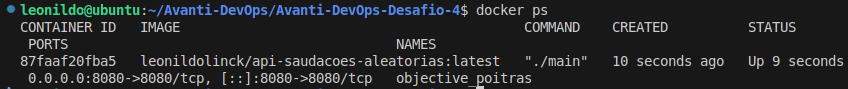

Teste com:

```bash
curl http://localhost:8080/api/saudacoes/aleatorio
```

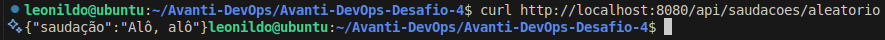

# 4. Automatizando o CI/CD com GitHub Actions (```main.yaml```)

YAML (YAML Ain't Markup Language) é uma linguagem de serialização de dados feita para ser fácil de ler. Ela usa indentação para organizar informações, como uma lista de tarefas ou configurações. Como o YAML é Usado em CI/CD
Em esteiras de CI/CD (Integração Contínua/Entrega Contínua), o YAML é a escolha principal para definir como o trabalho deve ser feito. Ferramentas como GitHub Actions, GitLab CI/CD e Jenkins usam arquivos YAML.

Antes de mais nada precisamos criar uma pasta /github e dentro dela uma pasta /workflows, para que possamos organizar nosso repositório, e que o GitHub Actions possa ler os arquivos:

```bash
mkdir github
mkdir github/workflows
cd github/workflows
```


Nele criaremos dois arquivos, ```main.yaml``` e ```destroy.yaml```.

### ```main.yaml```

## ```on:``` – Gatilhos de execução do pipeline

```yaml
on:
  push:
    branches:
      - main
      - "*"
  pull_request:
    branches:
      - main
  workflow_dispatch:
    inputs:
      destroy:
        description: "Destruir a infra após deploy?"
        required: false
        default: "false"

```
 Define os eventos que disparam o pipeline:

 - ```push:``` roda a pipeline ao fazer push na branch ```main``` ou em qualquer outra (```*```).
 
 - ```pull_request```: roda para PRs que visam a branch ```main```.
 
 - ``` workflow_dispatch```: permite rodar manualmente via GitHub com a opção de marcar/desmarcar se deseja destruir a infra após o deploy (```destroy```).

## ```env:``` – Variáveis globais de ambiente
```yaml
env:
  DOCKER_USER: ${{ vars.DOCKER_USER }}
  DOCKER_PASS: ${{ secrets.DOCKER_PASS }}
  DOCKER_IMAGE_NAME: ${{ vars.DOCKER_USER }}/api-saudacoes-aleatorias
  DOCKER_IMAGE_TAG: 1.0.${{ github.run_id }}
  SERVICE_NAME: saudacoes-aleatorias
```

Variáveis disponíveis para todos os jobs:

 - ```DOCKER_USER```: usuário do Docker Hub (via GitHub Variables).

 - ```DOCKER_PASS```: senha do Docker Hub (via GitHub Secrets).

 - ```DOCKER_IMAGE_NAME```: nome da imagem Docker.

 - ```DOCKER_IMAGE_TAG```: tag única baseada no ID da execução (```run_id```).

 - ```SERVICE_NAME```: nome do serviço implantado na Koyeb.

## ```jobs:```: – Execução em etapas
### ```lint:``` – Verificação de estilo e qualidade de código
```yaml
lint:
  name: Lint Code
  runs-on: ubuntu-latest
  if: github.ref_name != 'main'
  steps:
    - name: Checkout code
      uses: actions/checkout@v4

    - name: Set up Go
      uses: actions/setup-go@v5
      with:
        go-version: "1.22"

    - name: Go Fmt & Vet
      run: |
        echo "Linting code with go fmt and go vet..."
        go fmt $(go list ./...)
        go vet $(go list ./...)
    - name: Run golangci-lint
      uses: golangci/golangci-lint-action@v7
      with:
        version: v2.2.2
        args: --verbose
```

Executa ferramentas de lint (análise estática) para garantir boas práticas. Só é executado fora da ```main```:

 - ```go fmt```, ```go vet```: formatação e verificação básica.

 - ```golangci-lint```: análise profunda e multi-linter para código Go.

### ```test:``` – Execução dos testes automatizados

```yaml
test:
  name: Run Go Tests
  runs-on: ubuntu-latest
  needs: lint
  if: github.ref_name != 'main'
  steps:
    - name: Checkout code
      uses: actions/checkout@v4

    - name: Set up Go
      uses: actions/setup-go@v5
      with:
        go-version: "1.22"

    - name: Install gotestsum
      run: go install gotest.tools/gotestsum@latest

    - name: Run tests and generate report
      run: |
        echo "Running tests and generating report..."
        CGO_ENABLED=1 gotestsum --junitfile report.xml --format testname
    - name: Upload test results
      uses: actions/upload-artifact@v4
      if: always()
      with:
        name: test-reports
        path: report.xml
```

 Executa testes com relatório JUnit:

 - Instala ```gotestsum``` para formatar os testes.

 - ```CGO_ENABLED=1``` é ativado para compatibilidade.

 - Sempre faz o upload do ```report.xml```, mesmo em caso de falha.

### ```build-and-push:``` – Build e push da imagem Docker

```yaml
build-and-push:
  name: Build and Push Docker Image
  runs-on: ubuntu-latest
  if: github.event_name == 'push' && github.ref_name == 'main'
  steps:
    - name: Checkout code
      uses: actions/checkout@v4

    - name: Set up QEMU
      uses: docker/setup-qemu-action@v3

    - name: Set up Docker Buildx
      uses: docker/setup-buildx-action@v3

    - name: Log in to Docker Hub
      uses: docker/login-action@v3
      with:
        username: ${{ env.DOCKER_USER }}
        password: ${{ secrets.DOCKER_PASS }}

    - name: Build and push Docker image
      uses: docker/build-push-action@v5
      with:
        context: .
        platforms: linux/amd64,linux/arm64
        push: true
        tags: |
          ${{ env.DOCKER_IMAGE_NAME }}:${{ env.DOCKER_IMAGE_TAG }}
          ${{ env.DOCKER_IMAGE_NAME }}:latest
```
 Compila e publica a imagem Docker com suporte a múltiplas arquiteturas:

 - Usa **QEMU** e **buildx** para builds multiplataforma.

 - Faz login no Docker Hub com os segredos.

 - Envia a imagem com duas tags: uma única (```1.0.run_id```) e outra ```latest```.

### ```deploy:``` – Aplicação do Terraform na Koyeb

```yaml
deploy:
  name: Deploy to Staging
  runs-on: ubuntu-latest
  needs: build-and-push
  if: github.event_name == 'push' && github.ref_name == 'main'
  environment: staging
  env:
    TFC_TOKEN: ${{ secrets.TFC_TOKEN }}
    KOYEB_TOKEN: ${{ secrets.KOYEB_TOKEN }}
  steps:
    - name: Checkout code
      uses: actions/checkout@v4

    - name: Set up Terraform
      uses: hashicorp/setup-terraform@v3
      with:
        cli_config_credentials_token: ${{ secrets.TFC_TOKEN }}

    - name: Terraform Init
      id: init
      run: terraform -chdir=infra init
      env:
        TFC_TOKEN: ${{ secrets.TFC_TOKEN }}

    - name: Terraform Validate
      id: validate
      run: terraform -chdir=infra validate

    - name: Terraform Apply
      id: apply
      run: terraform -chdir=infra apply -auto-approve
      env:
        KOYEB_TOKEN: ${{ secrets.KOYEB_TOKEN }}
        TF_VAR_docker_image_name: ${{ env.DOCKER_IMAGE_NAME }}
        TF_VAR_docker_image_tag: ${{ env.DOCKER_IMAGE_TAG }}
```

 Provisiona (ou atualiza) a infraestrutura da aplicação com Terraform:

 - Só executa após **```build-and-push```**.

 - Usa o **Terraform Cloud** (via ```TFC_TOKEN```) como backend remoto.

 - Define o ambiente como **```staging```** (pode ser usado para proteger o deploy).

 - Passa as variáveis de imagem Docker para o Terraform (```TF_VAR_*```).


# 5. Destruindo a Infraestrutura com GitHub Actions (```destroy.yaml```)

### ```destroy.yaml```

```yaml
name: Destroy Infra

on:
  workflow_dispatch:

jobs:
  destroy:
    name: Destroy Staging Infra
    runs-on: ubuntu-latest
    environment: staging
    env:
      KOYEB_TOKEN: ${{ secrets.KOYEB_TOKEN }}
      TFC_TOKEN: ${{ secrets.TFC_TOKEN }}
    steps:
      - name: Checkout código
        uses: actions/checkout@v4

      - name: Setup Terraform
        uses: hashicorp/setup-terraform@v3
        with:
          cli_config_credentials_token: ${{ secrets.TFC_TOKEN }}

      - name: Terraform Init
        run: terraform -chdir=infra init
        env:
          TFC_TOKEN: ${{ secrets.TFC_TOKEN }}

      - name: Terraform Destroy
        run: terraform -chdir=infra destroy -auto-approve
        env:
          KOYEB_TOKEN: ${{ secrets.KOYEB_TOKEN }}
          TF_VAR_docker_image_name: ${{ env.DOCKER_IMAGE_NAME }}
          TF_VAR_docker_image_tag: ${{ env.DOCKER_IMAGE_TAG }}
```


 Este workflow é responsável por destruir a infraestrutura no ambiente de **staging**.

 - **`on: workflow_dispatch`**: Indica que este workflow só pode ser executado **manualmente** (via interface do GitHub).

 - **`jobs: destroy`**: Define o único job neste workflow, chamado "destroy".
   - **`name: Destroy Staging Infra`**: Nome descritivo do job.
   - **`runs-on: ubuntu-latest`**: O job será executado em uma máquina virtual Ubuntu.
  - **`environment: staging`**: Vincula o job ao ambiente `staging`, o que pode impor proteções de ambiente.
   - **`env`**: Define variáveis de ambiente específicas para este job.
     - `KOYEB_TOKEN`: Token para autenticação na Koyeb (via GitHub Secrets).
     - `TFC_TOKEN`: Token para autenticação no Terraform Cloud (via GitHub Secrets).
   - **`steps`**: Sequência de ações a serem executadas.
     - **`Checkout código`**: Clona o repositório.
     - **`Setup Terraform`**: Configura o Terraform na máquina, usando o `TFC_TOKEN` para autenticação no Terraform Cloud.
     - **`Terraform Init`**: Inicializa o Terraform no diretório `infra`, configurando o backend remoto no Terraform Cloud.
     - **`Terraform Destroy`**: Executa o comando `terraform destroy -auto-approve` no diretório `infra`, que remove todos os recursos gerenciados pelo Terraform. O `-auto-approve` dispensa a confirmação manual. Variáveis `KOYEB_TOKEN`, `TF_VAR_docker_image_name`, e `TF_VAR_docker_image_tag` são passadas para o Terraform, embora as últimas duas sejam mais relevantes para o `apply` e possam ser ignoradas no `destroy` dependendo da configuração do Terraform.

# 6. Configurando o Github Actions

Para configurar o GitHub Actions para sua esteira de CI/CD, siga este passo a passo:

**Criação do Repositório no GitHub**:
Começamos criando um novo repositório no GitHub para hospedar o código da sua aplicação e os arquivos de configuração da esteira. Este será o centro do seu projeto, onde todas as automações serão definidas e executadas.

**Criação do Workflow**:
Dentro do nosso repositório, criamos um diretório .github/workflows/. e dentro dele, adicionamos dois arquivos YAML (```main.yml``` e ```destroy.yml``` ). Estes arquivos definirão a lógica da sua esteira de CI/CD, incluindo gatilhos, jobs e passos. É aqui que nós descrevemos anteriormente as ações de lint, teste, build e deploy.

**Definição de Variáveis e Segredos**:
No GitHub, vá para as configurações do seu repositório (Settings > Secrets and variables > Actions).
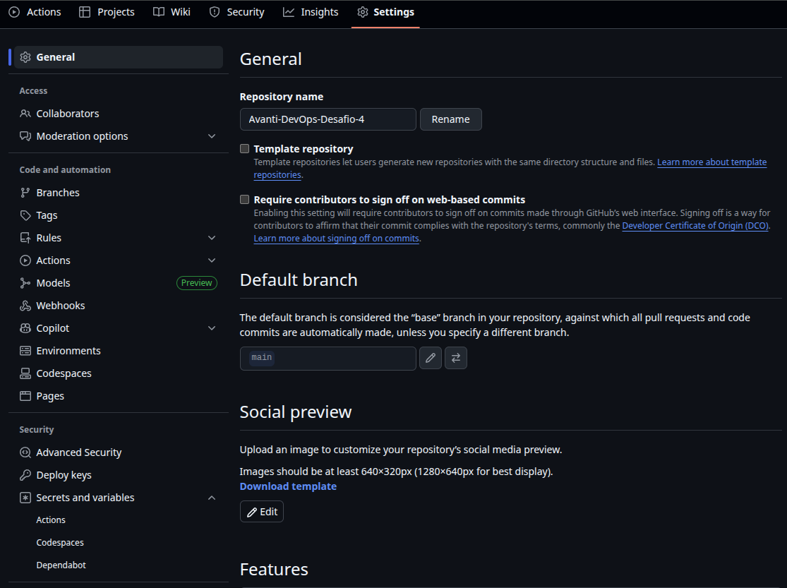

**Variáveis (Variables)**: Criaremos variáveis para dados que não são sensíveis, como ```DOCKER_USER```.
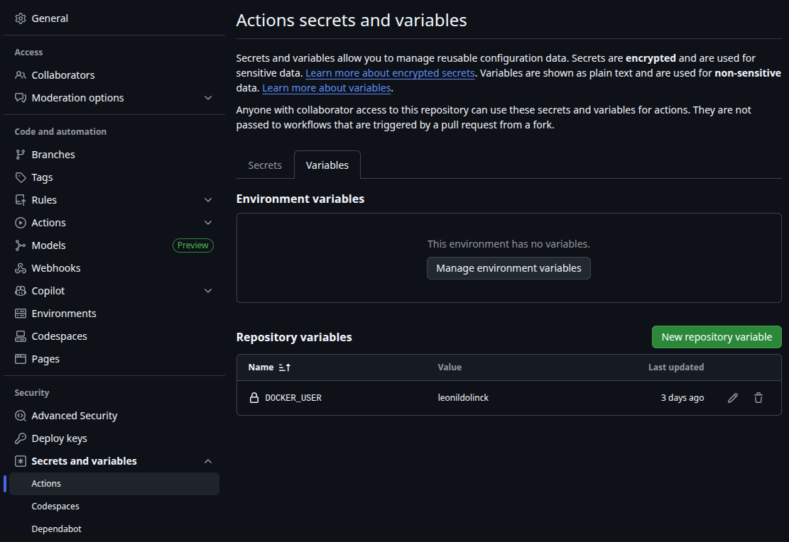

**Segredos (Secrets)**: Armazenaremos informações sensíveis, como senhas (```DOCKER_PASS```) e tokens (```TFC_TOKEN```, ```KOYEB_TOKEN```), como segredos. Isso garante que nossas credenciais nunca sejam expostas no código ou nos logs da esteira.
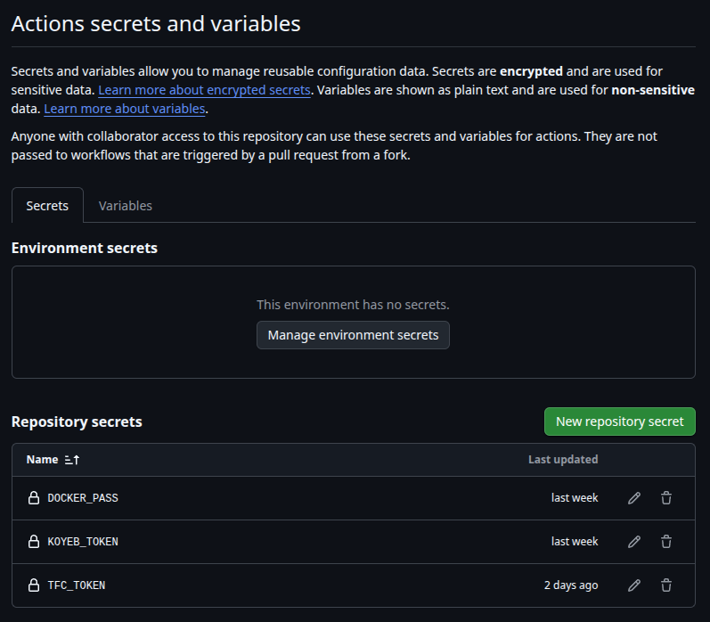

# 7. Funcionamento da pipeline no GitHub Actions

### Fazendo um commit (push)

Nesta primeira etapa do pipeline, o código é recebido em um branch e passa por testes de lint (qualidade do código) e testes unitários (testes automatizados).

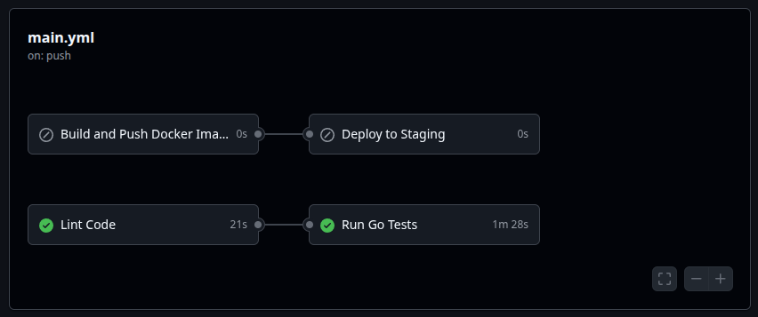

### Fazendo um Pull Request

Ao aprovar e mesclar um Pull Request, o código é testado novamente. Pode parecer redundante, mas é essencial para atestar a qualidade do código.

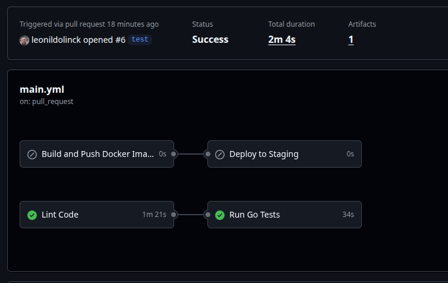

### Fazendo um deploy

Após os testes, uma imagem Docker é criada e enviada para o Docker Hub. Em seguida, o Terraform provisiona a infraestrutura no Koyeb.


### Destruindo a aplicação

Para destruir temos que manualmente iniciar o workflow ```destroy.yaml```.

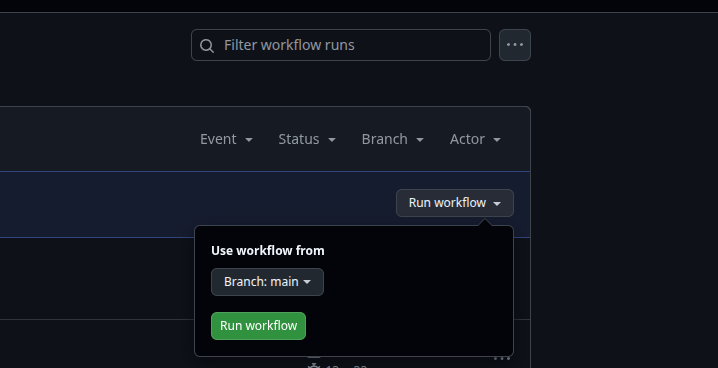

Após isso toda a infraestrutura provisionada no Koyeb é destruída.

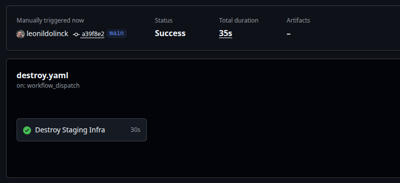


### Resultado

Imagem no dockerhub com versionamento através de tags:
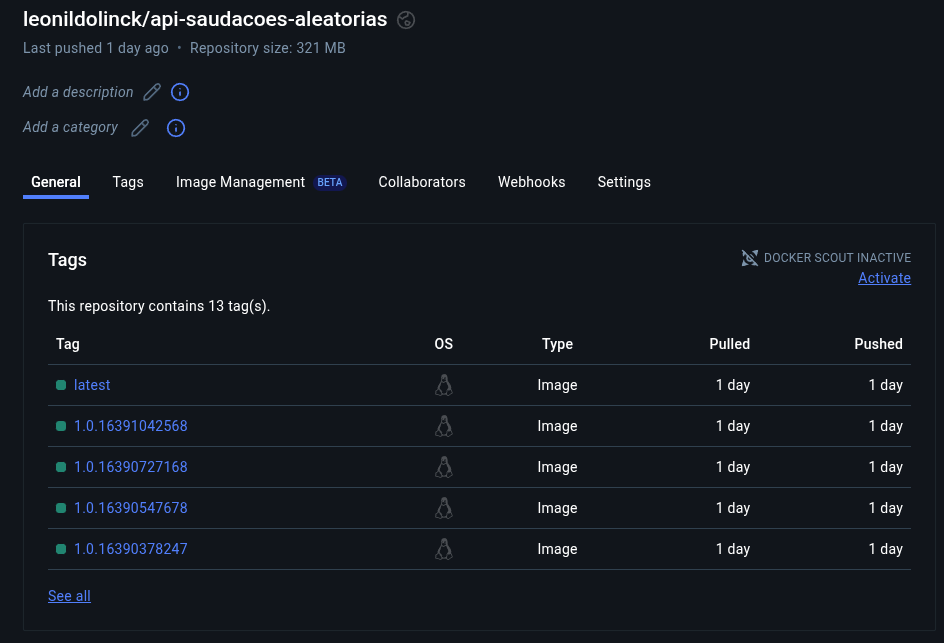

Aplicação (container) rodando no koyeb, pronto para uso:
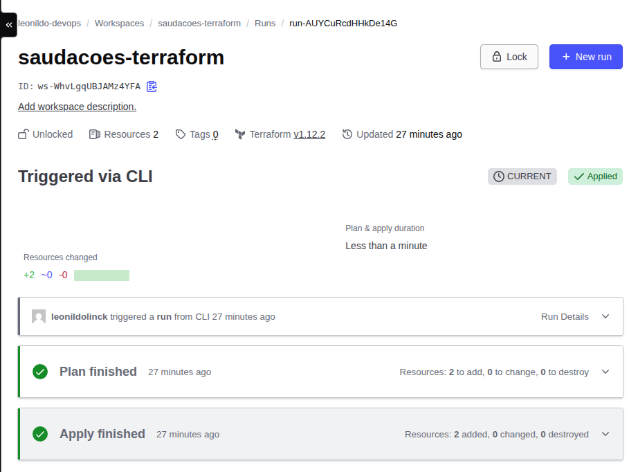

**Resposta da API:**

Aqui faremos um requisição HTTP para a API, que nos responderá conforme o código elaborado no arquivo ```handlers/saudacoes.go```:

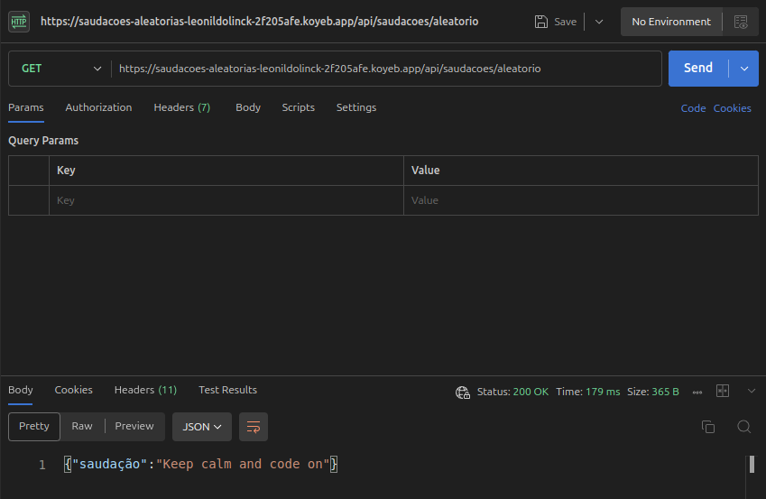

## Conclusão

Neste projeto, exploramos as etapas de uma esteira CI/CD no GitHub Actions, desde o provisionamento de infraestrutura até a criação e hospedagem de contêineres Docker no Docker Hub.

Este trabalho tem um objetivo educacional, aplicando as práticas aprendidas no BootCamp Avanti DevOps do Instituto Atlântico Avanti.

Sinta-se a vontade para fazer qualquer comentário ou sugestão!

## Contato

- **Email:** leonildolinck@gmail.com  
- **Discord:** leonildo  
- **LinkedIn:** [linkedin.com/in/leonildolinck](https://linkedin.com/in/leonildolinck)